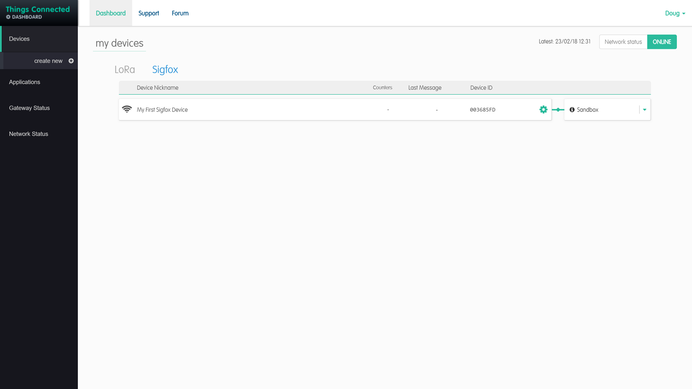

# Things-Connected-Add-a-Device
Adding a Sigfox device on the things connected portal

1. Register for things connected you will need access to your email account and be able to recieve SMS messages. Once you are registered you will be able to add your devices to the Sigfox LPWAN Network.

1. Select Sigfox as we are going to be registering a sigfox device.
2. Now select create device then get your device you will need the information on it.

- The top number is the Device Id
- The bottom number is the PAC Code

 

 

 

1. Enter a name for your device
2. Enter the Device Id and PAC codes in the appropriate text boxes
3. Click Next

This should complete the creation of your device on the system. It may take up to 5 mins for the registration to complete so please be patient. 

